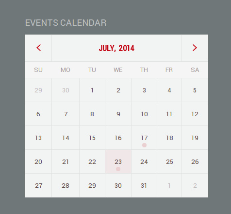

# jquery.datepicker custom styling

Calendar adjusted to be able to display events on a particular date.  

This tiny project contains extract for all classes which used to customize UI look of jquery-ui datepicker widget.

Run `bower install` to install necessary components.

Run `compass compile --sass-dir scss --css-dir stylesheets` to compile css files after _.scss_ files has been changed.

An example of resulting calendar  

